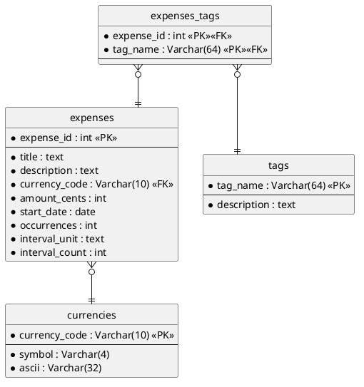

= Database

This chapter describes how the expense tracker persists its data: the entities,
their relationships, and the design decisions behind the schema.

== Overview

The `expenses` table is the heart of the model. Each row is one expense, which
may be a one-off or repeat on a schedule. Every expense uses a currency from the
`currencies` table, and each expense can be tagged with any number of `tags`,
connected through the `expenses_tags` table.

== Entity-Relationship Diagram

The ER diagram below is hand-authored and lives under
`docs/diagrams/src/man/`. It is not regenerated by `adoc-gen`; render it with
PlantUML when it changes:

[source,sh]
----
plantuml docs/diagrams/src/man/database-er.puml -o ../../out/man
----

== Entities

=== expenses

The central table. Each row is one expense definition. Recurring expenses are
modelled by storing the recurrence *rule* rather than expanding every
occurrence into its own row (see <<Recurrence>>).

[cols="1,1,1,3",options="header"]
|===
| Column | Type | Key | Notes

| `expense_id`     | int          | PK | Surrogate primary key.
| `title`          | text         |    | Short human-readable name.
| `description`    | text         |    | Free-form details.
| `currency_code`  | Varchar(10)  | FK | References `currencies.currency_code`.
| `amount_cents`   | int          |    | Amount in minor units (cents) to avoid floating-point rounding.
| `start_date`     | date         |    | First occurrence of the expense.
| `occurrences`    | int          |    | Number of times the expense repeats.
| `interval_unit`  | text         |    | Recurrence unit: `day`, `week`, `month`, or `year`.
| `interval_count` | int          |    | Recurrence multiplier (e.g. `2` with unit `week` = every two weeks).
|===

=== currencies

A lookup table of supported currencies. Keeping currencies in their own table
keeps the symbol and display data in one place and lets `expenses` reference a
currency by a stable code.

[cols="1,1,1,3",options="header"]
|===
| Column | Type | Key | Notes

| `currency_code` | Varchar(10) | PK | ISO-style code, e.g. `EUR`, `USD`.
| `symbol`        | Varchar(4)  |    | Display symbol, e.g. `€`, `kr`. Wide enough for multi-byte and multi-character symbols.
| `ascii`         | Varchar(32) |    | ASCII fallback for terminals without symbol support.
|===

=== tags

A flat list of tags that can be attached to expenses.

[cols="1,1,1,3",options="header"]
|===
| Column | Type | Key | Notes

| `tag_name`    | Varchar(64) | PK | The tag itself, used as its natural key.
| `description` | text        |    | Optional explanation of what the tag means.
|===

=== expenses_tags

A junction (many-to-many) table linking expenses and tags. Its primary key is
the *composite* of both foreign keys, so a given tag can appear on an expense at
most once.

[cols="1,1,1,3",options="header"]
|===
| Column | Type | Key | Notes

| `expense_id` | int         | PK, FK | References `expenses.expense_id`.
| `tag_name`   | Varchar(64) | PK, FK | References `tags.tag_name`.
|===

== Relationships

[cols="1,1,3",options="header"]
|===
| From | To | Cardinality

| `expenses`      | `currencies` | Many expenses use one currency (`}o--||`).
| `expenses_tags` | `expenses`   | Many links to one expense (`}o--||`).
| `expenses_tags` | `tags`       | Many links to one tag (`}o--||`).
|===

The two many-to-one links through `expenses_tags` together express the
many-to-many relationship between `expenses` and `tags`.

[[Recurrence]]
== Recurrence model

Rather than store one row per payment, a recurring expense stores a *rule*:

* `start_date` -- when it begins
* `interval_unit` + `interval_count` -- how often it repeats (e.g. unit `week`,
  count `2` = every two weeks)
* `occurrences` -- how many times in total

The interval is modelled as two columns on `expenses` rather than its own
entity. An interval such as "every two weeks" is a *value*, not something with
its own identity that other rows reference, so it does not warrant a separate
table. If a labelled pick-list of intervals were ever needed (e.g. a
user-facing "Bi-weekly" label with display ordering), the interval could be
promoted to its own table referenced by a foreign key.

[NOTE]
====
Storing the rule rather than the expanded occurrences keeps the table compact,
but it means individual due dates must be computed at read time. Queries like
"what is due this month" require expanding the rule rather than a simple row
lookup.
====

== Design notes

Amounts are stored as integer `amount_cents` rather than a floating-point type.
Representing money as an integer count of minor units avoids the rounding errors
inherent in binary floating point.

Currency symbols are stored in `Varchar(4)` because not every symbol is a single
character -- some currencies use multi-character symbols (`kr`, `Fr`) or
multi-byte glyphs.
